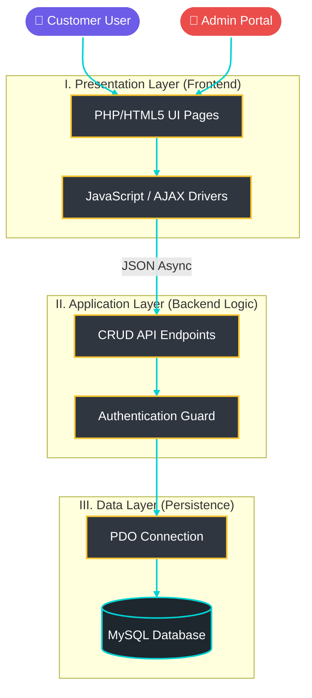
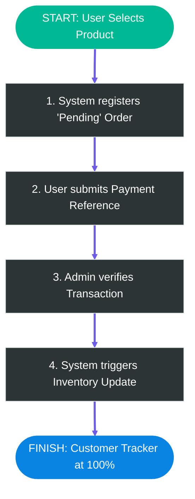
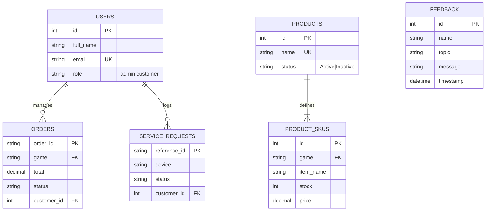

# 📑 Tech Noblade - Technical Documentation

> [!IMPORTANT]
> **Technical Overview for Project Defense**
> These diagrams are optimized for high-contrast viewing. For best results, use the **VS Code Markdown Preview** in Dark Mode.

---

## 🏗️ 1. System Architecture
Our platform follows a decoupled **Three-Tier Architecture**, ensuring clear separation between User Interaction, Business Logic, and Data Persistence.

---

## 🔄 2. System Process Flows

### 2.1 Top-Up Lifecycle (Vertical Timeline)
The specific lifecycle of a gaming transaction, showing the interaction between the system and human actors.

---

## 🗄️ 3. Data Architecture (Detailed ERD)
A high-precision map of the relational database, including primary and foreign key constraints.

---

## 🔒 4. Security Implementation Details

### 4.1 SQL Injection Mitigation
All database interactions are performed using **Prepared Statements**.
*   **Implementation:** `PDO::prepare()` or `mysqli::prepare()`.

### 4.2 Role-Based Access Control (RBAC)
Server-side session validation is enforced on all administrative endpoints via `api/auth_admin_guard.php`.

### 4.3 Data Encryption
Passwords are encrypted using **Bcrypt Hashing** via `password_hash()`.

---

## 🛠️ 5. Deployment Guide
1.  **Prerequisites:** PHP 7.4+, MySQL (Port 3307).
2.  **Database Connection:** Centralized in `api/db.php`.
3.  **Initialization:** Execute `db/schema.sql`.
