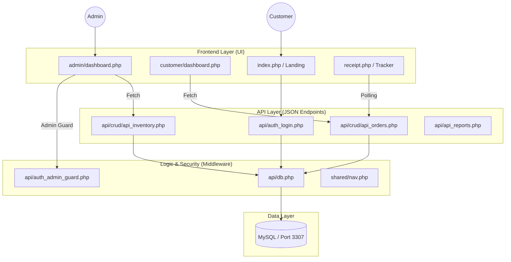
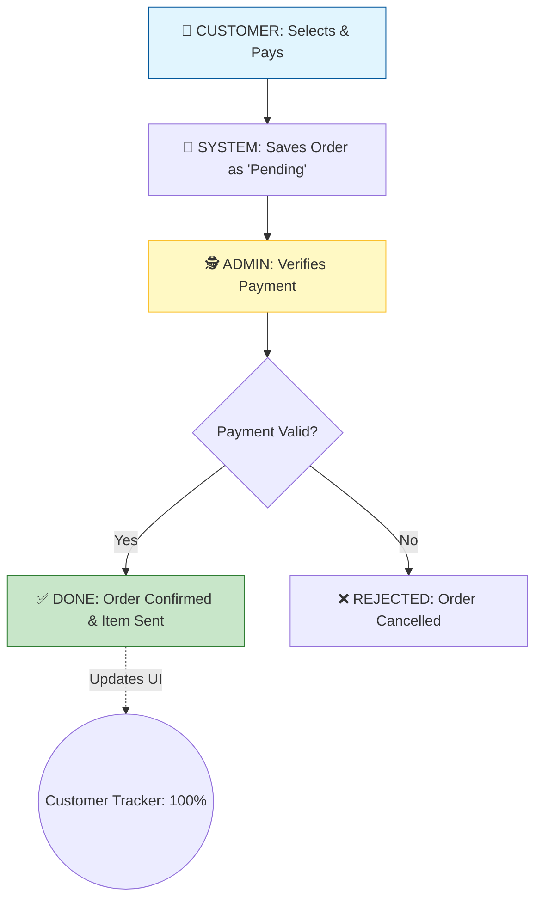
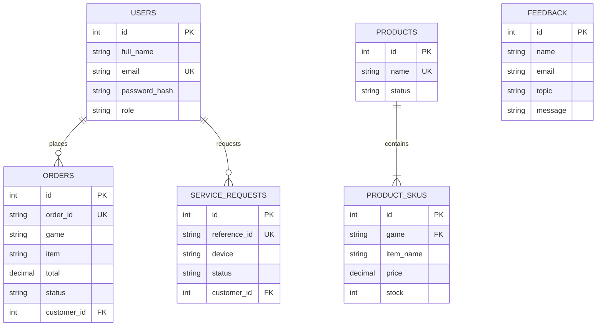

# 📑 Tech Noblade & Top Up - Technical Documentation

This document provides a comprehensive technical overview of the Tech Noblade & Top Up management system, detailing its architecture, data flows, and security implementations.

---

## 🏗️ 1. System Architecture
The platform follows a **Three-Tier Architecture**, designed for high maintainability and security.

---

## 🔄 2. System Process Flows

### 2.1 Order & Top-Up Lifecycle (Simplified)
Imagine this as a "Grab/Lazada" process.

---

## 🗄️ 3. Database Architecture (ERD)
The system utilizes a relational schema optimized for transaction integrity.

---

## 🔒 4. Security Implementation Details

### 4.1 SQL Injection Mitigation
All database interactions are performed using **Prepared Statements**.
*   **Implementation:** `PDO::prepare()` or `mysqli::prepare()`.

### 4.2 Role-Based Access Control (RBAC)
Server-side session validation is enforced on all administrative endpoints via `api/auth_admin_guard.php`.

### 4.3 Data Encryption
Passwords are encrypted using **Bcrypt Hashing** via `password_hash()`.

---

## 🛠️ 5. Deployment Guide
1.  **Prerequisites:** PHP 7.4+, MySQL (Port 3307).
2.  **Database Connection:** Centralized in `api/db.php`.
3.  **Initialization:** Execute `db/schema.sql`.
