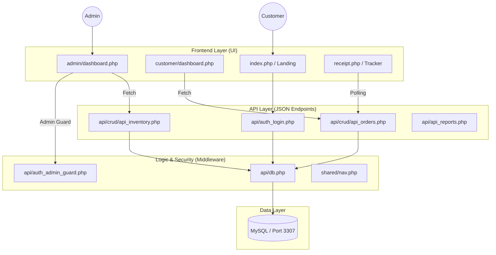
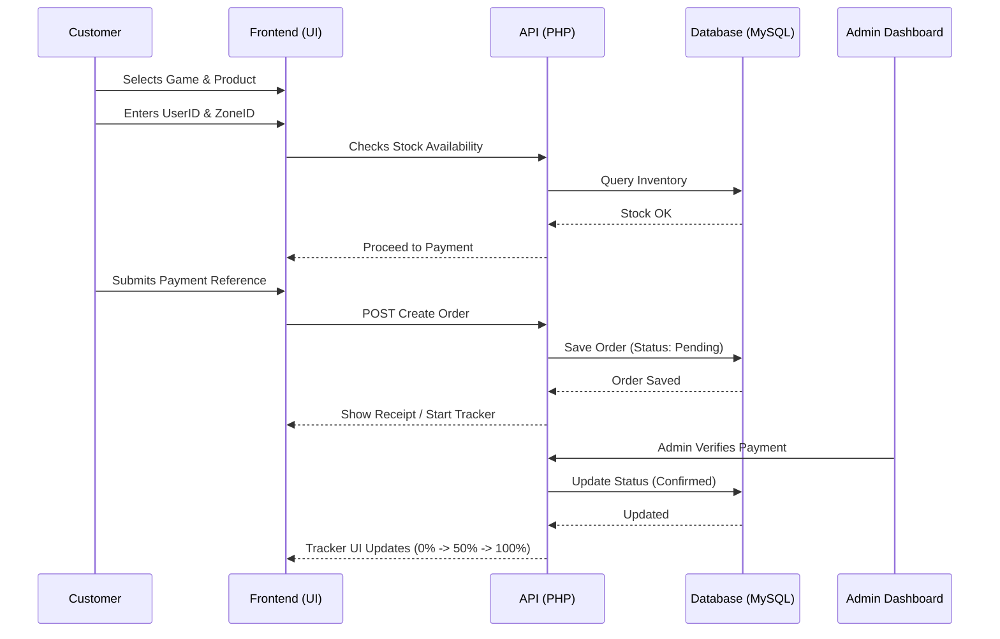
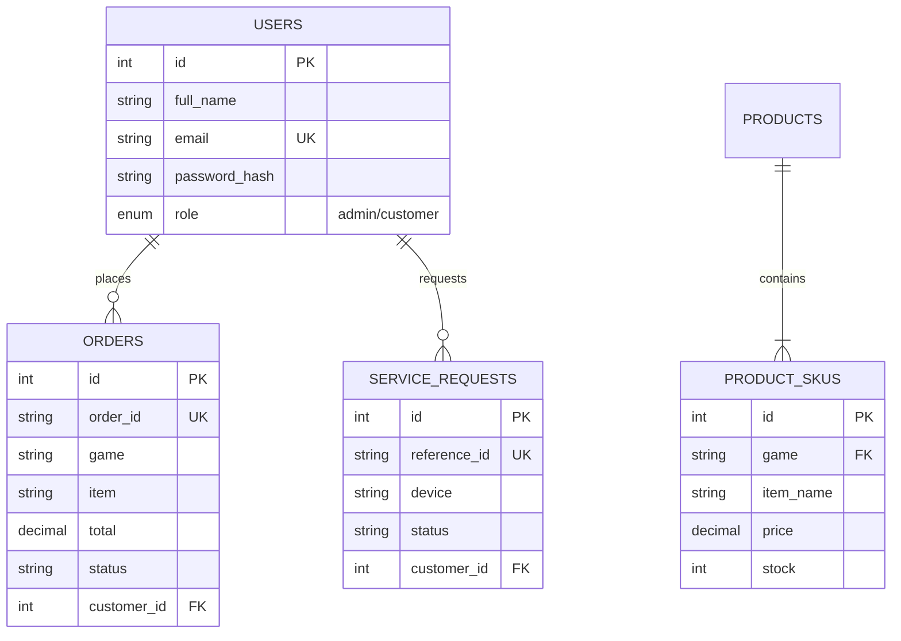

# 📑 Tech Noblade & Top Up - Technical Documentation

This document provides a comprehensive technical overview of the Tech Noblade & Top Up management system, detailing its architecture, data flows, and security implementations.

---

## 🏗️ 1. System Architecture
The platform follows a **Three-Tier Architecture**, effectively decoupling the Presentation Layer from the Application Logic and Data Persistence layers.

---

## 🔄 2. System Process Flows

### 2.1 Gaming Top-Up Lifecycle
The sequence below illustrates the automated flow of a gaming top-up transaction from user selection to administrative verification.

---

## 🗄️ 3. Database Architecture (ERD)
The system utilizes a relational schema optimized for transaction integrity and referential safety.

---

## 🔒 4. Security Implementation Details

### 4.1 SQL Injection Mitigation
All database interactions are performed using **Prepared Statements**. This ensures that user inputs are treated strictly as data, neutralizing potential SQL injection attacks.
*   **Implementation:** `PDO::prepare()` or `mysqli::prepare()`.

### 4.2 Role-Based Access Control (RBAC)
Server-side session validation is enforced on all administrative endpoints. 
*   **Gatekeeper:** `api/auth_admin_guard.php`.
*   **Logic:** Unauthorized access attempts without an active `'admin'` session role are automatically redirected to `admin/login.php`.

### 4.3 Data Encryption
Passwords are never stored in plain text. The system utilizes **Bcrypt Hashing** via `password_hash()` and `password_verify()`, providing industry-standard cryptographic protection.

---

## 🛠️ 5. Deployment Guide
1.  **Prerequisites:** PHP 7.4+, MySQL/MariaDB (configured for Port 3307).
2.  **Database Connection:** Centralized in [db.php](file:///c:/xampp/htdocs/tech-noblade/api/db.php). Update `$host`, `$user`, and `$pass` as necessary for production environments.
3.  **Initialization:** Execute [schema.sql](file:///c:/xampp/htdocs/tech-noblade/db/schema.sql) to build the required tables and initial product catalogs.
